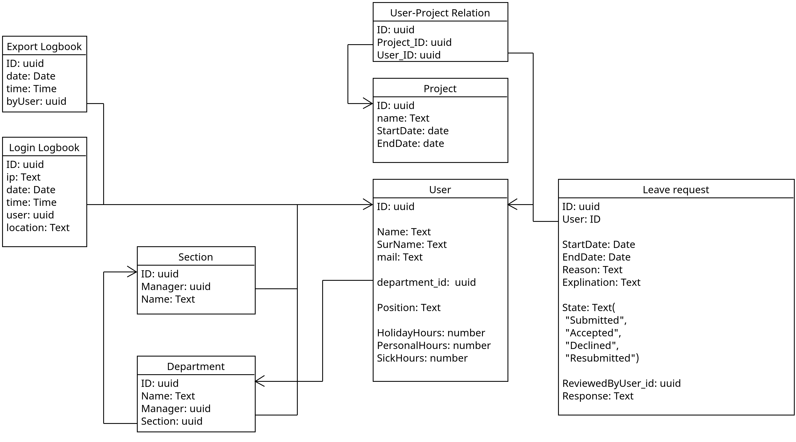

<style>
h1 {
    page-break-before: always;
    color: rgb(57, 170, 207);
    width: 100%;
    border-bottom: 1px solid rgb(57, 170, 207); 
}

.title {
    font-size: 32px;
}
</style>

<div class="title">
Technisch ontwerp
</div>

- [Tech Stack](#tech-stack)
  - [Framework](#framework)
  - [Packages](#packages)
  - [Versie beheer](#versie-beheer)
  - [Database](#database)
- [Architectuur](#architectuur)
  - [Frontend](#frontend)
  - [Backend](#backend)
  - [Database-structuur](#database-structuur)
  - [API-ontwerp](#api-ontwerp)
  - [Authenticatie en Autorisatie](#authenticatie-en-autorisatie)
  - [Hosting en Deployment](#hosting-en-deployment)
- [Functionele Specificaties](#functionele-specificaties)
  - [Gebruikersrollen](#gebruikersrollen)
  - [Use cases](#use-cases)
  - [UI en UX Design](#ui-en-ux-design)
- [Test Strategie](#test-strategie)
- [Beveiliging](#beveiliging)
  - [Gegevensencryptie](#gegevensencryptie)
  - [Veiligheidsmaatregelen](#veiligheidsmaatregelen)
  - [Logging en Monitoring](#logging-en-monitoring)
- [Prestaties en Schaalbaarheid](#prestaties-en-schaalbaarheid)
- [Documentatie en code conventie](#documentatie-en-code-conventie)

# Tech Stack

De volgende frameworks, libraries en software applicaties worden gebruikt.

## Framework
Het framework wat gebruikt gaat worden is Next.js. 
Next.js is een web compleet framework, wat gebaseerd is op React. Het heeft een makkelijk en snel ontwikkelproces.

Next.js kan geschreven worden in JavaScript of TypeScript. Voor dit project is TypeScript gekozen, vanwege het feit dat hier minder foutgevoelige code mee wordt geschreven.

## Packages

De packages worden gemanaged door NPM.

De packages die gebruikt worden zijn:
*   Shadcn voor UI-componenten
*   Tailwind voor CSS

## Versie beheer

GIT wordt gebruikt voor versiebeheer en deployment. 
De GIT-repo wordt op GitHub gehost.

## Database

De database die gebruikt wordt is Supabase. Voor nu is het nog niet duidelijk of deze zelf wordt gehost (lokaal) of op de servers van Supabase.



# Architectuur

## Frontend

De frontend is gebouwd met Next.js in combinatie met TypeScript. Het ondersteunt server-side rendering (SSR) voor snellere laadtijden en betere SEO, evenals client-side rendering (CSR) voor interactieve elementen.

## Backend

De backend bestaat uit Next.js API-routes, gecombineerd met Supabase als database-backend en authenticatiesysteem. Supabase biedt ingebouwde API's voor CRUD-operaties.

## Database-structuur

Een gedetailleerd schema van de database, inclusief tabellen voor gebruikers, verlofaanvragen, en goedkeuringen. Zorg voor een goede relatie tussen de entiteiten.

## API-ontwerp

Documentatie van alle API endpoints, zoals:
- `POST /api/leave-request`: Voor het indienen van een verlofaanvraag
- `GET /api/leave-requests`: Voor het ophalen van alle verlofaanvragen

## Authenticatie en Autorisatie

De applicatie maakt gebruik van Supabase-authenticatie voor inlog- en toegangsbeheer. JWT-tokens worden gebruikt voor autorisatie en beveiliging van API-aanroepen.

## Hosting en Deployment

De applicatie wordt gehost op Vercel, wat speciaal is ontworpen voor Next.js-applicaties. Continuous Deployment (CD) wordt geïmplementeerd via GitHub en Vercel.

# Functionele Specificaties

## Gebruikersrollen

De applicatie kent verschillende gebruikersrollen, zoals medewerker, manager en HR-beheerder, elk met hun eigen rechten en functionaliteiten.

## Use cases

Beschrijf alle belangrijke use cases, zoals verlof aanvragen, goedkeuren, annuleren, en rapporten genereren.

## UI en UX Design

Het ontwerp houdt rekening met toegankelijkheid (a11y) en responsiviteit. Tailwind wordt gebruikt voor styling, en Shadcn voor herbruikbare componenten.

# Test Strategie

Testen zal plaatsvinden op zowel frontend als backend. Supabase wordt niet getest, aangezien het een beheerde service is.

Er wordt gebruik gemaakt van:
- **Jest** voor unit testing
- **Cypress** voor end-to-end testing

# Beveiliging

## Gegevensencryptie

Zowel de communicatie tussen client en server als de opslag van gegevens wordt beveiligd met SSL en encryptie van gevoelige informatie.

## Veiligheidsmaatregelen

Bescherming tegen veelvoorkomende kwetsbaarheden zoals SQL-injecties, Cross-Site Scripting (XSS), en Cross-Site Request Forgery (CSRF).

## Logging en Monitoring

Gebruik van tools zoals Sentry voor foutmonitoring en Supabase logs voor backend logging en auditing.

# Prestaties en Schaalbaarheid

Er wordt caching gebruikt waar mogelijk, en Vercel's edge-netwerk zorgt voor snelle laadtijden wereldwijd. Schaalbaarheid wordt gewaarborgd door serverless functionaliteiten van Vercel en Supabase.

# Documentatie en code conventie

Documentatie van de code zal plaatsvinden in de code. 
Er zal gebruik gemaakt worden van een Doxygen-documentatievorm.

```ts
class Foo {
    /**
     * @brief bar function of foo
     * 
     * @todo nog geen implementatie
     * @return void
     */
    public Bar() {
    }
}
